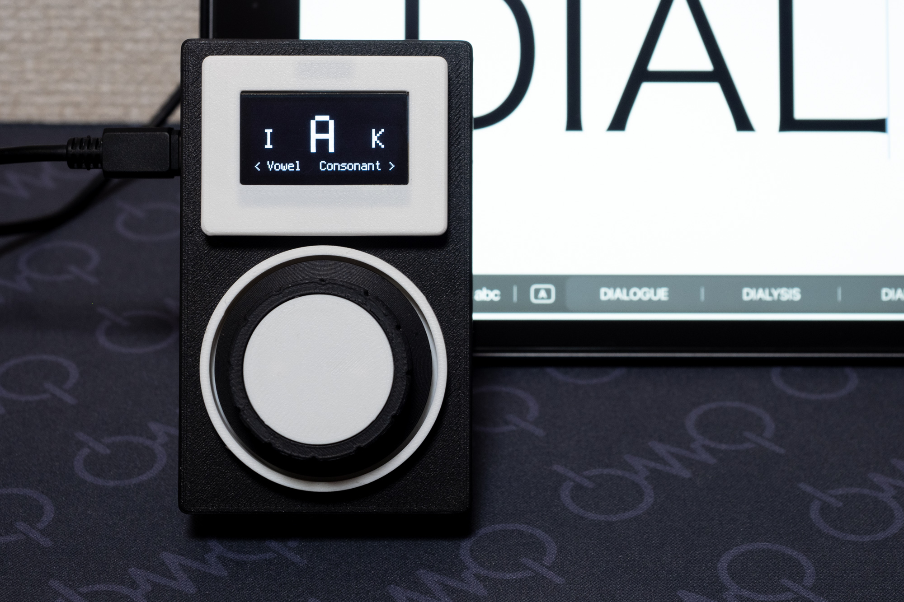

# DIAL input device



ロータリーエンコーダとスイッチを使った、ダイヤル錠をモチーフにしたユニークなキーボード入力デバイスです。

## 特徴

ロータリーエンコーダを左右に回して文字を入力するデバイスです。  
USBキーボードとして動作します。

通常のアルファベット・数字・記号を入力するモードと日本語入力に特化したモードの2つを切り替えて使用できます。  
US/JISのキーコードに対応しています。

## ハードウェア要件

- Seeed Studio XIAO RP2040
- ロータリーエンコーダ
- タクトスイッチ(ロータリーエンコーダに押し込みスイッチがない場合)
- I2C OLEDディスプレイ (SH1106, 128x64)

## 配線

[回路図](dial_input_device_schematic.pdf)

### ロータリーエンコーダ

- CLK (A) → XIAO D9
- DT (B) → XIAO D10
- GND → XIAO GND
- - → XIAO 3V3

### スイッチ

- 片方の足 → XIAO D7
- もう片方の足 → XIAO GND

### I2C OLEDディスプレイ

- SCL → XIAO SCL (D5)
- SDA → XIAO SDA (D4)
- VCC → XIAO 3V3
- GND → XIAO GND

## 必要なライブラリ

CircuitPythonの`lib`フォルダに以下をコピー:

- `adafruit_displayio_ssd1306.mpy`
- `adafruit_display_text` (フォルダ)

## 使い方

本デバイスには、アルファベットや記号を入力する「基本モード」と、日本語入力に特化した「日本語モード」の2つの主要なモードがあります。

### 基本モード (Basic Mode)

金庫のダイヤルのような操作で文字を入力するモードです。アルファベット、数字、記号の入力に適しています。

1.  **文字の選択**:
    - ロータリーエンコーダを回して、ディスプレイに表示される文字を選択します。
2.  **文字の入力**:
    - **回転方向の反転**: 金庫のダイヤルのように、回転方向を逆にする（例: 右回転→左回転）と、選択中の文字が入力されます。
    - **シングルクリック**: スイッチを1回クリックすると、選択中の文字が入力されます。
    - **ダブルクリック**: `Shift + 選択中の文字`（大文字や記号など）が入力されます。

> **Note:** クリックで入力した後、意図しない入力を防ぐために一時的な待機状態（ニュートラルモード）になります。左右どちらも選択モードになります。

### 日本語モード (Japanese Mode)

ダイヤル操作を元に子音・母音を分割して左右に回しながらローマ字で日本語を入力します。  
左に回すと子音の選択、右に回すと母音の選択になります。

### BS/スペースモード

スイッチを長押しするとBS/スペースを入力するモードになります。
左右に回してBS/スペースを入力します。逆方向に回すと元のモードに戻ります。

> **Note:** スペース入力後に逆方向に回すとエンターが入力されたあとに元のモードへ戻ります。

### 設定変更

`config.py`で以下を変更できます:

```python
# キーボードレイアウト
KEYBOARD_LAYOUT = 'JIS'  # 'US' または 'JIS'

# ピン配置
ENCODER_PIN_A = board.D9
ENCODER_PIN_B = board.D10
SWITCH_PIN = board.D7

```

## ライセンス

MIT License  
(c) 2025 Takuya Urakawa (@hsgw 5z6p.com)

## ciurcuitpython/lib内のライセンス

これらはAdafruit CircuitPythonライブラリであり、MITライセンスの下で提供されています。

Copyright (c) 2016 Adafruit Industries
